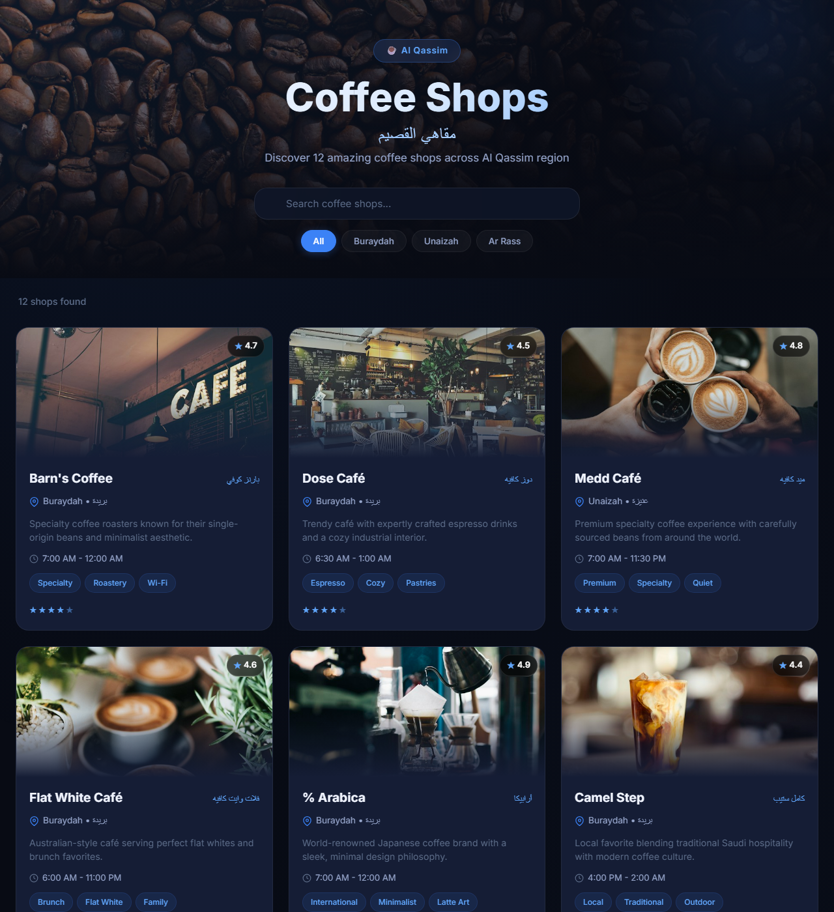

# ☕ Al Qassim Coffee Shops | مقاهي القصيم

A bilingual (English / Arabic) directory of 12 specialty coffee shops across the Al Qassim region of Saudi Arabia, with instant search and city filtering.

**🔗 Live demo: [coffees-in-qassim.vercel.app](https://coffees-in-qassim.vercel.app)**



## Features

- **Instant search** by shop name (English or Arabic), description, or tag
- **City filter** (Buraydah, Unaizah, Ar Rass) — the list of cities is built automatically from the data
- **Card view** with photo, rating, location, opening hours, and tags
- **Clear Filters** button and a friendly "no results" state
- **Responsive layout** that adapts to tablet and mobile screens

## Tech Stack

- [React 19](https://react.dev/) (hooks: `useState`, `useMemo`)
- [Vite](https://vite.dev/) for development and build
- Plain CSS (no UI library)
- Deployed on [Vercel](https://vercel.com/)

## How It Works

All shop data lives in a single JavaScript array (`src/data/coffeeShops.js`), so there is no backend or database. `App.jsx` keeps the search text and selected city in state, and filters the array with `useMemo` so the list is only recomputed when one of them changes. Each result is rendered by a `CoffeeCard` component.

## Project Structure

```
src/
├── App.jsx                 # state + filtering logic
├── components/
│   ├── Header.jsx          # hero, search box, city buttons
│   ├── CoffeeCard.jsx      # one shop card (rating stars, tags)
│   └── Footer.jsx
├── data/coffeeShops.js     # the 12 coffee shops
└── index.css               # all styles
```

## Run Locally

```bash
git clone https://github.com/1jjl7/coffee-list.git
cd coffee-list
npm install
npm run dev
```

Then open the URL printed in the terminal (usually http://localhost:5173).

## Adding a Shop

Add a new object to the array in `src/data/coffeeShops.js` with the same fields as the others (`id`, `name`, `nameAr`, `location`, `locationAr`, `description`, `rating`, `hours`, `tags`, `image`). It appears on the page automatically — a new city will also get its own filter button.

## Author

**Ahmed Maher Algaoni** — [GitHub](https://github.com/1jjl7) · [Portfolio](https://1jjl7.github.io)
